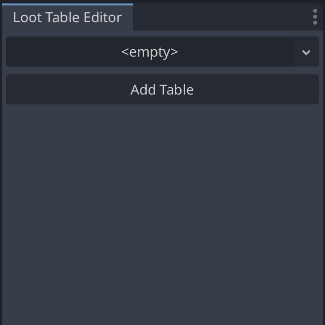

<p align="center">
	
</p>

# Loot Table Editor

A **Godot 4** plugin that adds a custom editor dock for creating and editing loot tables. With this tool you can visually define multiple `LootTable` resources (grouped by level), add weighted `LootEntry` items (with configurable drop amounts), and persist your data directly into Resource (`.tres`) assets.

---

## 🎯 Features

* **Drag‑and‑drop resource picker** for selecting or creating `LootTableDatabase` assets
* **List view** showing all tables with level and entry counts
* **Per‑table editor**: set table level and manage its entries
* **Entry controls**: configure `loot` (PackedScene), `amount`, and `weight` via intuitive SpinBoxes
* **Live saving**: edits are immediately written back to the resource asset
* **Runtime API**: pick entries or scenes by level with built‑in weight sampling

---

## 🚀 Requirements

* **Godot 4.4** or later
* **GDScript** enabled (the plugin is implemented in GDScript)

---

## 📦 Installation

1. Clone or download the repository into your project’s `addons/` folder:

   ```bash
   git clone https://github.com/yourusername/loot_table_editor.git addons/loot_table_editor
   ```
2. In the Godot Editor, open **Project → Project Settings → Plugins**.
3. Find **Loot Table Editor** in the list and press **Enable**.

---

## 🛠 Usage

1. Right-click in the FileSystem dock and choose **New Resource** → **LootTableDatabase**. Save it as `loot_db.tres`.
2. In your main scene or a dedicated manager, add a **Node** and attach a script that references your database:

   ```gdscript
   @export var loot_db: LootTableDatabase

   func _ready():
       var entry = loot_db.pick_entry_by_level(player_level)
       if entry:
           for i in range(entry.amount):
               var inst = entry.loot.instantiate()
               add_child(inst)
   ```
3. Open the **Loot Table Editor** dock from **Editor → Editor Docks → Loot Table Editor**. Use the picker to load `loot_db.tres`.
4. Click **Add Table** to create a new table, set its **Level**, then **Add Entry** to configure drop items.
5. For each entry, choose a **Loot Scene**, set **Amount** (how many to drop), and **Weight** (sampling probability).
6. All changes are saved automatically into your Resource (`.tres`) asset.

---

## 🎨 Example Screenshots

<p align="center">
	
	&nbsp;&nbsp;&nbsp;&nbsp;&nbsp;&nbsp;
	
</p>
<p align="center">
	
</p>

---

## 🤝 Contributing

We welcome contributions! Please refer to our [CONTRIBUTING](CONTRIBUTING.md) file for detailed instructions on how to contribute to this project.
Please follow the GDScript style guide and write clear commit messages.

---

Developed by [orumcan](https://github.com/orumcan)
